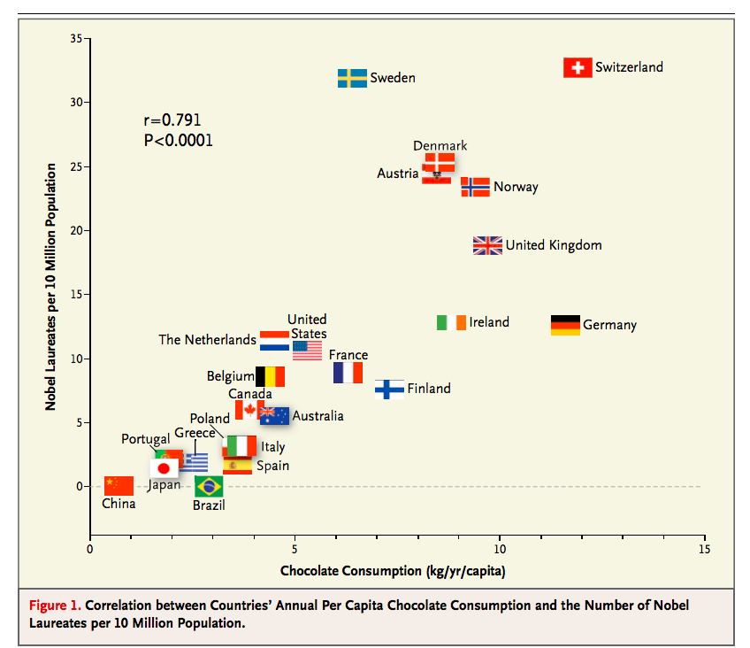
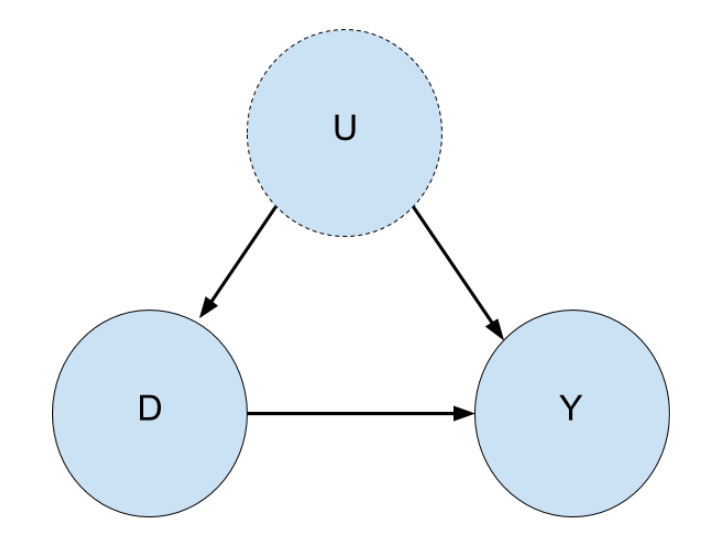
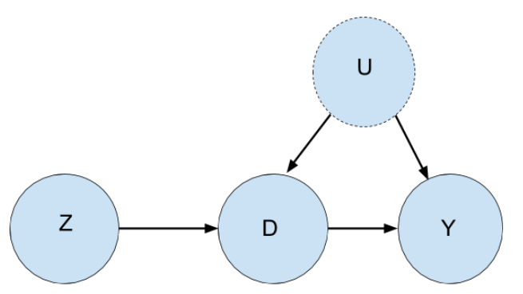
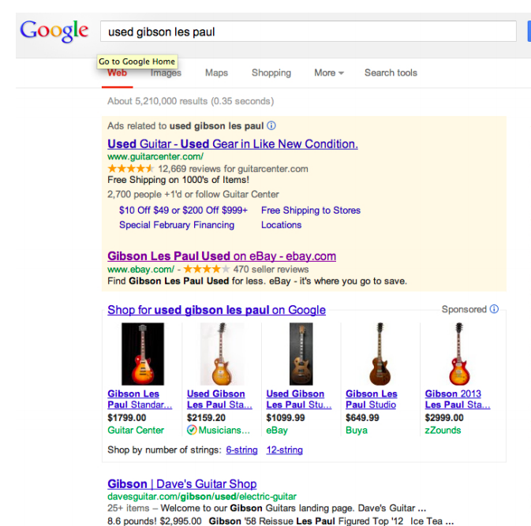
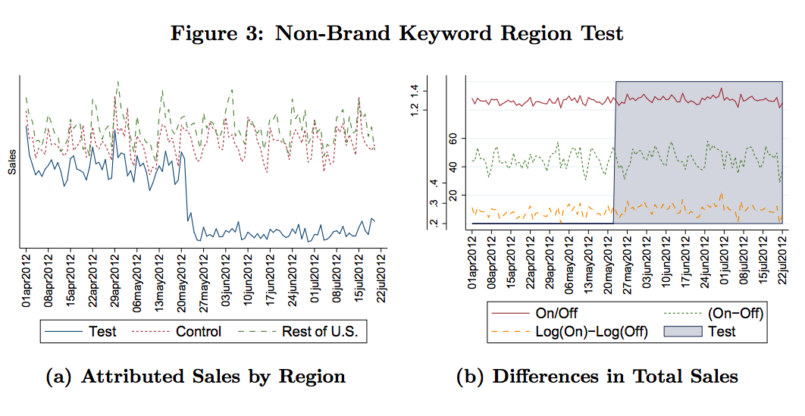
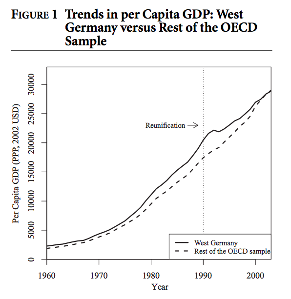
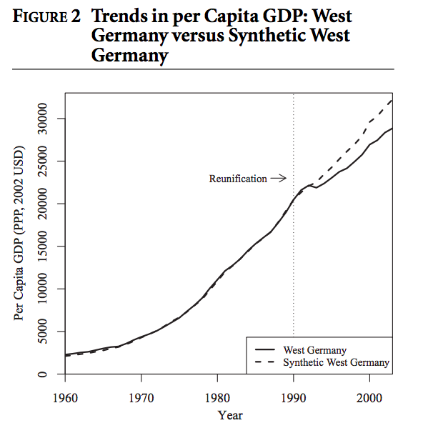
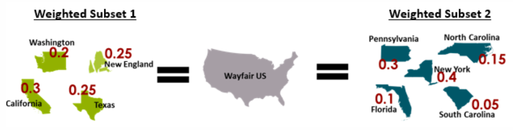
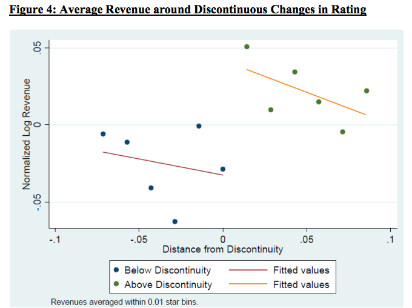

```{r setup, include=FALSE}
options(htmltools.dir.version = FALSE)
knitr::opts_chunk$set(echo = FALSE, 
                      fig.align = 'center', 
                      warning = FALSE, message = FALSE, out.width = "85%",
                      fig.width = 7,
                      dpi = 300,
                      fig.asp = 9/16)

library(tidyverse)
library(magrittr)

```

```{r xaringan-themer, include=FALSE}
library(xaringanthemer)

# solarized_dark(
#   code_font_family = "Fira Code",
#   code_font_url    = "https://cdn.rawgit.com/tonsky/FiraCode/1.204/distr/fira_code.css"
# )


duo(
  primary_color = "#fcedd1",
  secondary_color = "#2a488e",
  header_font_google = google_font("Josefin Sans"),
  text_font_google   = google_font("Montserrat", "300", "300i"),
  code_font_google   = google_font("Droid Mono"),
  text_font_size = "25px"
)

write_extra_css(list("strong" = list("font-weight" = "900px"), 
                     "ul" = list("list-style-type" = "none", 
                                 "margin" = "0", "padding" = "0"), 
                     ".large" = list("font-size" = "130%"), 
                     ".small" = list("font-size" = "80%")))

theme_wyt <- function(base_size = 11, base_family = "", base_line_size = base_size/22, base_rect_size = base_size/22){
  # theme_light() %+replace%
  ggthemes::theme_fivethirtyeight(base_size = base_size,
                                  base_family = base_family) %+replace%
    theme(
      plot.background = element_rect(fill = "#fcedd1", colour = "#fcedd1"),
      panel.background = element_rect(fill = "#fcedd1", colour = "#fcedd1"),
      title = element_text(colour = "black"),
      axis.title = element_text(), 
      legend.background = element_rect(fill = "#fcedd1"), 
      legend.key = element_rect(fill = "#fcedd1"), 
      legend.direction = "vertical",
    )
}
theme_set(theme_wyt(base_size = 13))

```

```{r}
rm(list = ls())
library(tidyverse)
library(magrittr)

```

# About Me
  
Finishing my PhD in Economics at The Ohio State University

Economics of science and innovation

R, dataviz, causal inference

--

Improv at [The Nest Theatre](https://nesttheatre.com/) on Broad St.

---

## What happens if you do X?

- Does employment decrease if you raise the minimum wage?

- Does investing in stem cell research actually lead to more research?

- Will running an advertising campaign raise revenue?

--

These are questions about **causation**

---

## Estimating causal effects is the bread and butter of many economists

Provide intuition for how economists and social scientists have approached this problem

Inspiration for ways you might apply this in other contexts

---

## Caveats

Lots of advances in methodology have come from other fields including political science, epidemiology, statistics, computer science

Only one part of econometrics and economics

---

class: inverse, middle

## Why is estimating causal effects hard?

---

## Eating chocolate wins Nobel Prizes?

```{r chocolate, out.width="60%"}

```

---

## .large[$$y = D\beta+ X\gamma + u$$]

- $y$ is an outcome we care about (e.g. wages)

- $D$ is an indicator for a treatment/intervention (e.g. going to college)

- $X$ are some characteristics we observe ("observables")

- $u$ is stuff we don't observe ("unobservables")

--

#### The goal is estimate $\beta$, the effect of $D$ on $y$

--

###  Why can't we just run a regression and call it a day?

---

## People don't make choices randomly

People who go to college are different than people who don't go to college 

- Different social networks
- Different aptitudes

--

### Many of these differences are *unobserveable* and could directly affect wages

---

## The effect of $U$ on $Y$ is wrongly attributed as the effect of D on Y

```{r, out.width="60%"}

```

---

## Usual Solution? Randomized Control Trials (RCTs)

- Naive regression ends up comparing people with different unobservables 

- If we randomly assign the treatment, then the treatment and control groups have similar unobservables (on average)

---

## But RCTs are not always feasible

- Some things can't be A/B tested (e.g. TV ads)
- Expense
- Internal resistance
- Ethics (randomly assign lead poisoning)

---

class: inverse, middle

## Quasi-experiments can be helpful here

---
class: middle

### Sometimes experiments pop up "in the wild" because of arbitrary decisions or events

---

## Quasi-experimental designs

- Instrumental variables
- Difference-in-differences 
- Synthetic control 
- Regression discontinuity


---

## Focus is on credibility of Research Design, less on methods

- To what extent does this approximate an actual randomized experiment?

- Estimation is often done with linear regression

---

class: middle, inverse

## Instrumental variables

---

## Cool origin story

- First appears in appendix of a book on animal and vegetable oil tariffs

- Unclear if idea came from the author, economist Philip Wright, or his son, a geneticist 

- Text analysis shows the writing style most closely matched Philip's 

---

## Intuition

Problem: College attendance and wages are both related to unobserved characteristics

An *instrument* is something that affects college attendance but NOT wages

Roughly, we are using the instrument to "purge" the part of college attendance that is explained by unobservables

---

## What makes a good instrument?

1. Relevant: Has an effect on the intervention ( $Z$ affects $D$)

2. Exclusion restriction: Only related to the outcome through its effect on intervention ( $Z$ only affects $Y$ through $D$) 

---

## The exclusion restriction is untestable

```{r}

```

---

## Finding clever instruments is an entire industry...

- Gender of children as instrument for family size
- Quarter-of-birth for years spent in school
- Muslim holidays as for number of drivers on the road

---

## ...but *randomization* is a great instrument!  

- Oregon Medicaid Lottery

- If you have A/B tests, you have instruments!

---

## Do referrals increase retention?

- Problem: people who already refer more friends are probably more invested in the product

- Solution: find an A/B test that successfully increased referrals (e.g. an email campaign) and you have a ready-made instrument

---

## Validity checks

There are statistical tests for relevance of an instrument

Exclusion restriction is usually justified based on institutional knowledge

Check that there is balance across observables - e.g. if instrument is binary, then check that units exposed to instrument look similar to units not exposed to instrument

---

class: inverse, middle

## Difference-in-differences

---

### If you use quasi-experimental designs, you will almost certainly use difference-in-differences

---

## Example

- Say you want to know how an increase in the Ohio state minimum wage changed employment

- If employment decreased after the minimum wage increased, does that mean the causal effect of the minimum wage was to decrease employment?

---

## Intuition

- Use a control group to account for underlying time trends 

- E.g. find a state that had similar trends in employment to Ohio before the minimum wage increase happened

---

## Similar trends, different levels

```{r dd_plots}

set.seed(1)
n <- 10 ^ 3

simulatedError <- rnorm(n = n)
group <- sample(c(T, F), n, replace = TRUE)

df <- tibble(time = 10 * round(runif(n), 1) - 5,
                 treatment = group,
                 error = simulatedError)

df %<>%
    mutate(Y = 1 + 4 * (time >= 0) + 5 * treatment + 7 * (time >= 0) * treatment + error)

# fit <- lm(Y ~ time + treatment + I((time >= 0) * treatment), data = df)
# summary(fit)

dfmean <- df %>%
    group_by(time, treatment) %>%
    summarise(Y = mean(Y))

df %<>% 
  mutate(g = case_when(
    treatment & time < 0 ~ "a", 
    treatment & time >= 0 ~ "b", 
    !treatment & time < 0 ~ "c", 
    !treatment & time >= 0 ~ "d"
  ))

ggplot(data = df, 
       aes(x = time, y = Y, 
           colour = treatment, 
           group = g
           )
       ) + 
  aes(alpha = g) + 
  geom_point() + 
  geom_line(stat = "smooth", method = lm, se = FALSE) + 
  geom_vline(xintercept = -0.5, linetype = 2) + 
  scale_color_manual(values = c("#F05253", "#2A73CC", "#F05253", "#2A73CC")) + 
  scale_alpha_manual(values = c(1, 0, 1, 0), guide = F) + 
  theme(legend.position = c(0.2, 0.8)) 
```

---

## Control and Treated groups both increased

```{r}
ggplot(data = df, 
       aes(x = time, y = Y, 
           colour = treatment, 
           group = g
           )
       ) + 
  geom_point() + 
  geom_line(stat = "smooth", method = lm, se = FALSE) + 
  geom_vline(xintercept = -0.5, linetype = 2) + 
  scale_color_manual(values = c("#F05253", "#2A73CC", "#F05253", "#2A73CC")) + 
  theme(legend.position = c(0.2, 0.8)) 
```

---

## Take the difference before and after treatment for the treatment and contrl groups

```{r}
ggplot(data = df, 
       aes(x = time, y = Y, 
           colour = treatment, 
           group = g
           )
       ) + 
  geom_point() + 
  geom_line(stat = "smooth", method = lm, se = FALSE) + 
  geom_vline(xintercept = -0.5, linetype = 2) + 
  scale_color_manual(values = c("#F05253", "#2A73CC", "#F05253", "#2A73CC")) + 
  theme(legend.position = c(0.2, 0.8))  + 
  annotate(geom = "rect", 
           xmin = -0.5-0.2, xmax = -0.5 + 0.2, 
           ymin = 1, ymax = 5, fill = "#F05253") + 
  annotate(geom = "rect", 
           xmin = -0.5-0.2, xmax = -0.5 + 0.2, 
           ymin = 6, ymax = 17, fill = "#2A73CC")
```

---

## Take the difference of those differences

```{r}
ggplot(data = df, 
       aes(x = time, y = Y, 
           colour = treatment, 
           group = g
           )
       ) + 
  geom_point() + 
  geom_line(stat = "smooth", method = lm, se = FALSE) + 
  geom_vline(xintercept = -0.5, linetype = 2) + 
  scale_color_manual(values = c("#F05253", "#2A73CC", "#F05253", "#2A73CC")) + 
  theme(legend.position = c(0.1, 0.8))  + 
  annotate(geom = "rect",
           xmin = -0.5-0.2, xmax = -0.5 + 0.2,
           ymin = 1, ymax = 5, colour = "#F05253", fill = NA,
           alpha= 0.5) +
  annotate(geom = "rect", 
           xmin = -0.5-0.2, xmax = -0.5 + 0.2, 
           ymin = 10, ymax = 17, fill = "#2A73CC") + 
  annotate(geom = "rect", 
           xmin = -0.5-0.2, xmax = -0.5 + 0.2, 
           ymin = 6, ymax = 10, fill = "#F05253", alpha = 0.5) + 
  annotate("linerange", 
           x = -.8, y = 20, ymin = 10, ymax = 17,
           size = 1.5) + 
  annotate("text", x = -2.25, y = 13, label = "Treatment Effect", size = 5) + 
  labs(title = "Subtract the red from the blue") 
```

---

## Difference-in-differences relies on the parallel trend assumption

Without the intervention, the treatment and control groups would have experienced the same time trends

---
## Parallel trend assumption

```{r}

dd_counterfac = df %>% 
  filter(treatment, time >= 0) %>% 
  mutate(Y = Y - 7)

ggplot(data = df, 
       aes(x = time, y = Y, 
           colour = treatment, 
           group = g
           )
       ) + 
  geom_vline(xintercept = -0.5, linetype = 2) +
  geom_smooth(data = dd_counterfac,  
              aes(x = time, y = Y), 
              colour = "#2A73CC", se = FALSE, method = "lm") + 
  geom_smooth(method = lm, se = FALSE) + 
  annotate("text", label = "With intervention", x = 2.5, y = 16, size = 5) + 
  annotate("text", label = "Without intervention", x = 2.5, y = 11, size = 5) + 
  theme(legend.position = "none") + 
  scale_color_manual(values = c("#F05253", "#2A73CC", "#F05253", "#2A73CC"))

```

---

## Example: Ineffectiveness of Paid search 

```{r ebayad, out.width="60%"}

```

---

## Randomization + Difference-in-differences

- Randomly selected cities to turn off paid search

- Selected control cities with similar trends in sales

- Estimated little to no effect of paid search on sales

---

```{r, out.width="75%"}

```

---

## Validity checks

- Statistical and graphical checks that trends are similar before the intervention

- Even if trends are similar, need to justify why *levels* are different

- Contextual knowledge: knowing what else is changing at the same time as the intervention

- Placebo test: an intervention on 6th graders should have no effect 8th graders

---

class: inverse, middle

## Synthetic Control

---

## Synthetic Control is a close cousin of difference-in-differences

Used in comparative case studies - how did an event affect aggregate outcomes of a single unit (e.g. country, state)?

Example: What was the economic impact of reunification on West Germany?

---

## Synthetic control finds the weighted combination of countries that are most similar to Germany

- Minimize the distance between West Germany and potential control countries based on a set of pre-unification variables (e.g. GDP per capita, trade openness, inflation rate)

---

## West Germany looks different from the rest of the OECD

```{r, out.width="50%"}

```

---

## West Germany and Synthetic West Germany look similar pre-reunification
```{r, out.width="50%"}

```

---

## Synthetic Control: How can you measure the impact of TV advertising?

- Can't randomly assign TV ads to individual users

- Instead, randomly assign treatment to cities 

---

## Two issues with randomizing by geographic area

1. There are a limited number of cities and they are very different from each other
2. If you divide up the US into treatment and control, then you can't estimate the effect for *entire* US

---

## Create synthetic US for both treated *and* control cities

.center2[
```{r}

```
]

---

## Regression discontinuity

- Compare units just above or below an arbitrary/random cutoff 

- E.g. test scores to get a scholarship

---

## Causal effect is difference between points "close" to the threshold

```{r}

mu <- matrix(c(0, 0))
rho <- 0.5
sigma1 <- 0.5
sigma2 <- 2
Sigma <- matrix(c(sigma1 ^ 2, 
                  rho * sigma1 * sigma2, 
                  rho * sigma1 * sigma2, 
                  sigma2 ^ 2),
                c(2, 2))

simulatedXandC <- MASS::mvrnorm(n = n, mu = mu, Sigma = Sigma)


df <- tibble(X = simulatedXandC[, 1],
                 C = simulatedXandC[, 2],
                 tee = (simulatedXandC[, 1] > 0),
                 error = simulatedError)

df %<>%
    mutate(Y = 10 + X ^ 3 + 5 * tee + 1 * C + error)

ggplot(data = df, aes(x = X, y = Y, color = (X > 0))) + 
  geom_point(alpha = 1/3) +
  geom_smooth(method = lm,   
                se = FALSE) + 
  annotate(geom = "rect",
           xmin = -0.05, xmax = 0.05, ymax = 15, ymin = 10) + 
  annotate(geom = "label", 
           x = -0.5, y = 12, label = "Treatment Effect") + 
  labs(color = "Treatment group") + 
  scale_colour_manual(values = c("#F05253", "#2A73CC")) + 
  theme(legend.direction = "horizontal")

```

---

## Do online reviews affect consumer demand?

Yelp rounds online ratings to the nearest half-star (3.24 -> 3, 3.25 -> 3.5)

Compared difference in revenue between firms around the rounding thresholds

---

## 1-star increase leads to 5-9% increase in revenue
```{r, out.width= "70%"}

```


---

## Regression discontinuity doesn't work if units around threshold are not randomly assigned

- There could be manipulation around the threshold e.g. influential parents lobby to get their children extra points if they're just below the threshold

---

## Validity Checks

1. Look at distribution of units around the threshold

2. Look at distribution of observables around the threshold

---

## #Units above threshold $\approx$ #Units below threshold

```{r}

df %>% 
  ggplot(aes(x = X)) + 
  geom_histogram(breaks = seq(-2, 2, 0.5), colour="white", fill = "#00B39F") + 
  geom_vline(xintercept = 0, linetype = 2, size = 1.3) + 
  labs(title = "No manipulation") 


```

---

```{r}
df %>%
  mutate(rand = runif(n()),
         X = ifelse(rand < 0.33 & X < 0, -X, X)) %>%
  ggplot(aes(x = X)) + 
  geom_histogram(breaks = seq(-2, 2, 0.5), colour="white", fill = "#00B39F") + 
  geom_vline(xintercept = 0, linetype = 2, size = 1.3) + 
  labs(title = "Manipulation - Unusual jump at threshold")

```

---

## Observables should not be "affected" by the discontinuity

In scholarship example, if we observe a jump in parental income at the discontinuity, then something is wrong


Placebo test works here: there should be no effect on an unrelated outcome

---

### Even if we are satisfied with our quasi-experiment (internally valid), how do we know it will accurately predict effects of a future action?

---

## Local average treatment effects

Often, we don't get to randomize across the whole population

E.g. in regression discontinuity, we're estimating the causal effect for people *around the threshold* and ignoring those far away from the threshold

This may still be relevant! Interventions often occur at the margin

---

## Equilibrium effects

Scaling up an intervention can have substantial effects on how people interact

E.g. Retaining sellers on an online marketplace could affect revenue gains due to competition

---

## Causal inference things I haven't covered

- Matching 

- Directed Acyclic Graphs (DAGs)

- Machine learning + causal inference

---

### Resources 

.small[
#### Books
- [Mostly Harmless Econometrics](https://www.amazon.com/Mostly-Harmless-Econometrics-Empiricists-Companion/dp/0691120358) or [Mastering 'Metrics (less technical)](https://www.amazon.com/Mastering-Metrics-Path-Cause-Effect-ebook/dp/B00MZG71MC) by Angrist and Pischke
- [Causal Inference: The Mixtape (free)](http://scunning.com/cunningham_mixtape.pdf)

#### Many ideas for this presentation were borrowed liberally from: 
- [What's the Science in Data Science? - Skipper Seabold](https://youtu.be/kTo16ieMCi8)
- [Teconomics](https://medium.com/teconomics-blog/)
- [Wayfair example on synthetic control](https://tech.wayfair.com/data-science/2017/08/using-geographic-splitting-optimization-techniques-to-measure-marketing-performance/)

#### Structural models are sometimes proposed as a way of overcoming external validity challenge
- [A light intro](https://towardsdatascience.com/the-holy-grail-of-econometrics-3a45a2295ce5) 
- [Big picture discussion of their role in research](http://noahpinionblog.blogspot.com/2017/05/how-should-theory-and-evidence-relate.html)
]

---
class: inverse, middle
# Questions

<i class="fas fa-envelope"></i> weiyang.tham@gmail.com

<i class="fab fa-twitter"></i> @wytham88

Website: wytham.rbind.io
